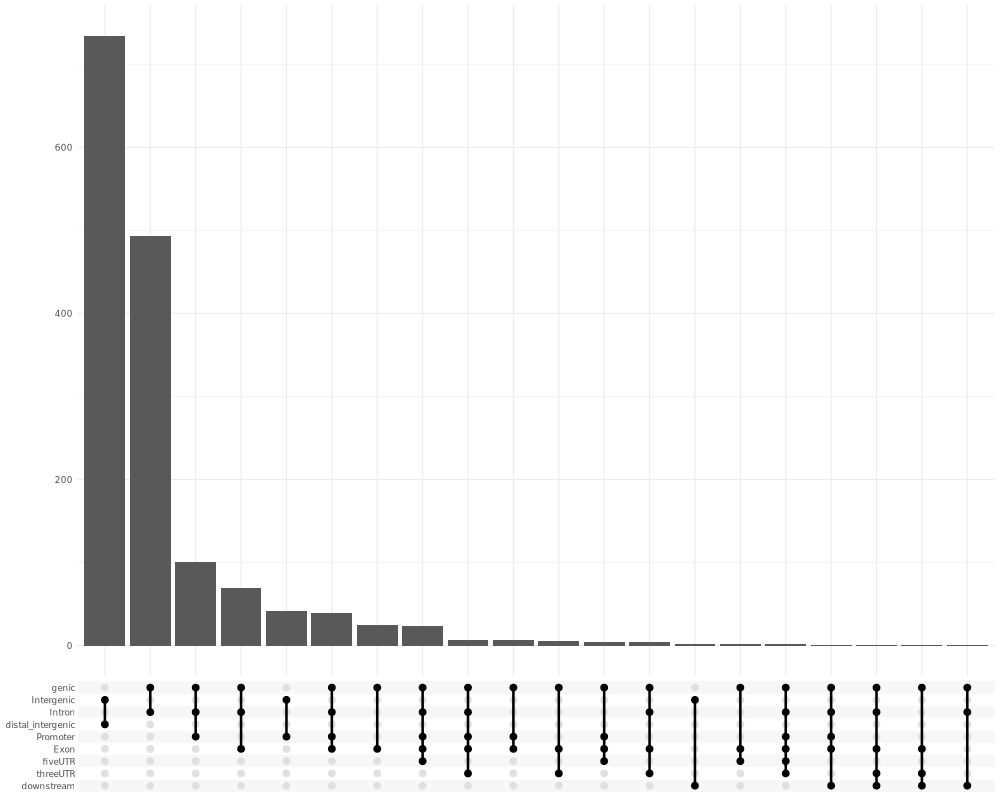

# Distribution of Peak Sizes

### ZF13_Nfiabx  

### ZF17_Rbpj  

### ZF21_Otx2  

### ZF29_Otx2  

# 🔬 ZF11_13 Nearby Genes

This project shows peak annotation results for the `ZF11_ZF13.bed` Cut&Run dataset using [ChIPseeker](https://bioconductor.org/packages/release/bioc/html/ChIPseeker.html). Peaks were annotated to the nearest genes based on the mm10 mouse genome.

--- 

## 📈 Peak Annotation Summary

### 🧠 Genomic Feature Distribution

  
*Distribution of peaks across genomic features (e.g., Promoter, Exon, Intergenic).*

---

### 📍 Distance to TSS

  
*Distribution of peak distances from the transcription start sites (TSS).*

---

### 🔗 Annotation Category Overlap (UpSet Plot)

  
*Overlap of peak annotations across multiple genomic categories.*

---

## 📄 Full Annotated Peaks Table

You can [download the full annotated peak list of ZF11_13 as a CSV file](./ZF11_13_peaks_annotated_nearby_genes.csv), which includes nearest genes, distances to TSS, and gene symbols.

---

# 🔬 ZF27_neurog2 Nearby Genes
  
This project shows peak annotation results for the `ZF27_neurog2` Cut&Run dataset using [ChIPseeker](https://bioconductor.org/packages/release/bioc/html/ChIPseeker.html). Peaks were annotated to the nearest genes based on the mm10 mouse genome.

--- 

## 📈 Peak Annotation Summary

### 🧠 Genomic Feature Distribution

*Distribution of peaks across genomic features (e.g., Promoter, Exon, Intergenic).*

---

### 📍 Distance to TSS

*Distribution of peak distances from the transcription start sites (TSS).*

---

### 🔗 Annotation Category Overlap (UpSet Plot)

*Overlap of peak annotations across multiple genomic categories.*

---

## 📄 Full Annotated Peaks Table

You can [download the full annotated peak list of ZF27 as a CSV file](./ZF27_peaks_annotated_nearby_genes.csv), which includes nearest genes, distances to TSS, and gene symbols.

---

# 🔬 ZF17_Rbpj Nearby Genes

This project shows peak annotation results for the `ZF17_Rbpj` Cut&Run dataset using [ChIPseeker](https://bioconductor.org/packages/release/bioc/html/ChIPseeker.html). Peaks were annotated to the nearest genes based on the mm10 mouse genome.

--- 

## 📈 Peak Annotation Summary

### 🧠 Genomic Feature Distribution

*Distribution of peaks across genomic features (e.g., Promoter, Exon, Intergenic).*

---

### 📍 Distance to TSS

*Distribution of peak distances from the transcription start sites (TSS).*

---

### 🔗 Annotation Category Overlap (UpSet Plot)

*Overlap of peak annotations across multiple genomic categories.*

---

## 📄 Full Annotated Peaks Table

You can [download the full annotated peak list of ZF17 as a CSV file](./ZF17_peaks_annotated_nearby_genes.csv), which includes nearest genes, distances to TSS, and gene symbols.

---

## 🧬 Annotation File Header Explained

The annotated peak file produced by **ChIPseeker** contains a mix of original peak coordinates and gene annotation metadata.

### 🗂️ Columns Breakdown

| Column Name       | Description |
|-------------------|-------------|
| `seqnames`        | Chromosome name (e.g., `chr1`, `chrX`) |
| `start` / `end`   | Start and end positions of the peak |
| `width`           | Length of the peak (`end - start + 1`) |
| `strand`          | Strand info (`+`, `-`, or `*` if unspecified) |
| `V4` – `V10`      | Additional columns from the original BED file (e.g., name, score, etc.) |
| `annotation`      | Genomic location of the peak (e.g., Promoter, Intron, Intergenic) |
| `geneChr`         | Chromosome of the nearest gene |
| `geneStart`       | Gene start coordinate |
| `geneEnd`         | Gene end coordinate |
| `geneLength`      | Gene length in base pairs |
| `geneStrand`      | Strand of the gene (`+` or `-`) |
| `geneId`          | Entrez gene ID |
| `transcriptId`    | Transcript ID of the annotated gene |
| `distanceToTSS`   | Distance from the peak to the transcription start site (TSS) |
| `ENSEMBL`         | Ensembl gene ID |
| `SYMBOL`          | Official gene symbol (e.g., `Myc`, `Tp53`) |
| `GENENAME`        | Full gene name or description (e.g., `myelocytomatosis oncogene`) |

This table helps interpret which genes each peak might be regulating or associated with, especially in promoter or enhancer regions.

**Note:**  
The columns `V4` to `V10` in the annotation file correspond to fields from a MACS2 narrowPeak file.  
You can find the detailed explanation of these columns here:  
[MACS2 narrowPeak format documentation](https://macs3-project.github.io/MACS/docs/narrowPeak.html#)

---

## 📏 Coordinate System Difference: BED vs ChIPseeker

When comparing peak coordinates between your original BED file and the output from ChIPseeker, you may notice a **1 base pair shift** in the start position. This is expected and is due to differences in the coordinate systems used by each format.

### 🔄 Coordinate System Comparison

| Format                  | Start Coordinate     | End Coordinate       | System Type         |
|-------------------------|----------------------|---------------------|---------------------|
| **BED**                 | 0-based (inclusive)  | 1-based (exclusive) | 0-based             |
| **ChIPseeker / GRanges**| 1-based (inclusive)  | 1-based (inclusive) | 1-based             |

### 📌 What This Means

A peak defined in a BED file as:

chr1 5019276 5019799

means:

- The **start** at `5019276` (0-based) becomes `5019277` when converted to 1-based coordinates.
- The **end** at `5019799` is exclusive in BED but becomes inclusive in 1-based formats.

So, ChIPseeker correctly represents this region as:

Both formats refer to the **same DNA segment**, just using different conventions.

### ✅ Summary Table

| Format      | Start     | End       | Represents (1-based view)     |
|-------------|-----------|-----------|-------------------------------|
| **BED**     | 5019276   | 5019799   | 5019277–5019799 (inclusive)   |
| **ChIPseeker** | 5019277 | 5019799   | 5019277–5019799 (inclusive)   |

This is not a bug — it's a standard and necessary conversion to ensure compatibility with Bioconductor tools like ChIPseeker, which use 1-based inclusive coordinates.

---

**Generated with:**  
- R  
- ChIPseeker  
- TxDb.Mmusculus.UCSC.mm10.knownGene  
- org.Mm.eg.db  

